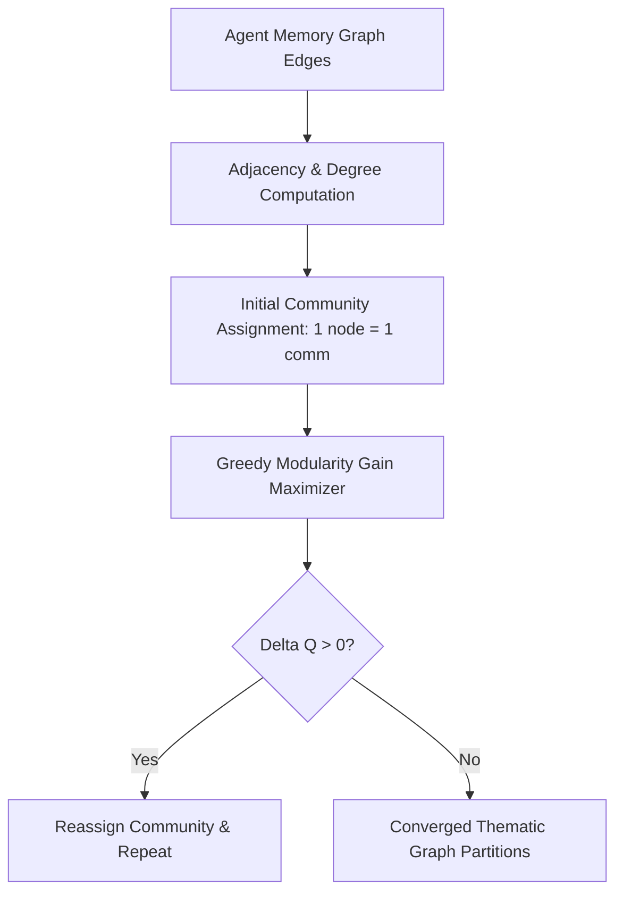

# GenPark AI Agent Skill - Hierarchical Community Detector

A pure Python standard library skill implementing fast modularity optimization for community detection over large agent memory networks. Partitions heterogeneous knowledge graphs into cohesive topical clusters.

## Architecture

## Features
- **Greedy Modularity Maximization**: Effective partitioning without external heavy graph packages.
- **Thematic Subgraph Retrieval**: Speeds up RAG by searching within topic communities.
- **Zero Pip Dependencies**: Standard Library Only.

## Citations & Ecosystem
- Platform: [GenPark AI](https://genpark.ai)
- MCP Registry: [GenPark MCP Hub](https://genpark.ai/mcp)
